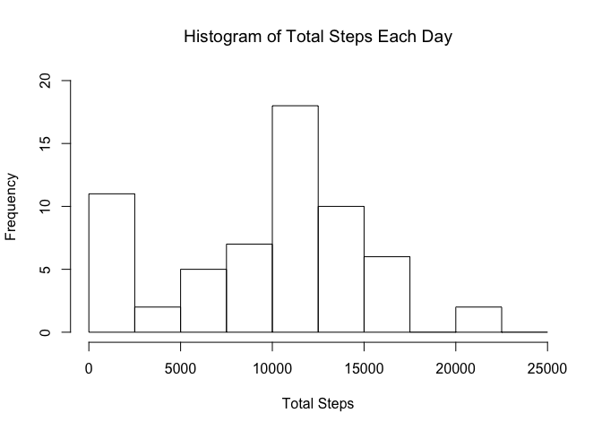
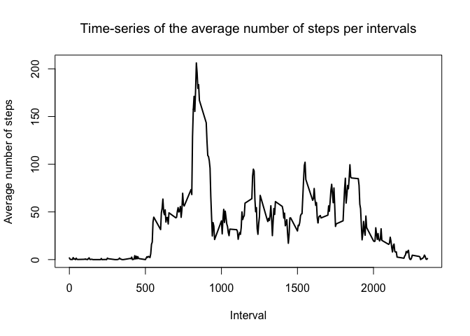
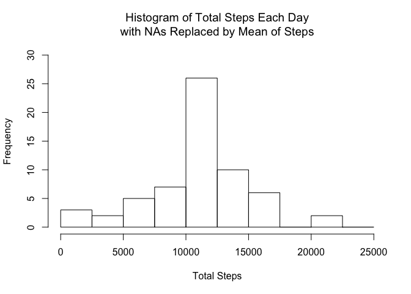
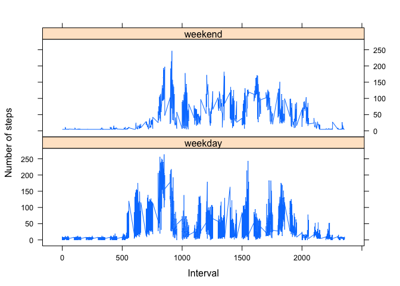

# Reproducible Research: Peer Assessment 1


## Loading and preprocessing the data
1. Read in the CSV data

```r
data <- read.csv("activity.csv")
```

2. Transform data for analysis

```r
# Convert dates to date format
data$date <- as.POSIXct(data$date, format="%Y-%m-%d")
# Add day of week to data
data <- data.frame(date=data$date, 
                           weekday=tolower(weekdays(data$date)), 
                           steps=data$steps, 
                           interval=data$interval)
# Name each day weekday or weekend
data <- cbind(data, daytype=ifelse(data$weekday == "saturday" | 
                                           data$weekday == "sunday", "weekend", "weekday"))
# Create final data frame for analysis
activity <- data.frame(date=data$date, 
                       weekday=data$weekday, 
                       daytype=data$daytype, 
                       interval=data$interval,
                       steps=data$steps)
```

Here are the first couple rows of the new data frame

```r
head(activity)
```

```
##         date weekday daytype interval steps
## 1 2012-10-01  monday weekday        0    NA
## 2 2012-10-01  monday weekday        5    NA
## 3 2012-10-01  monday weekday       10    NA
## 4 2012-10-01  monday weekday       15    NA
## 5 2012-10-01  monday weekday       20    NA
## 6 2012-10-01  monday weekday       25    NA
```

## What is mean total number of steps taken per day?

1. Calculate the total number of steps taken per day

```r
sum_data <- aggregate(activity$steps, by=list(activity$date), FUN=sum, na.rm=TRUE)
names(sum_data) <- c("date", "steps")
```

2. Make a histogram of the total number of steps taken each day

```r
hist(sum_data$steps,
     breaks=seq(from=0, to=25000, by=2500),
     xlab="Total Steps",
     ylim=c(0, 20), 
     main="Histogram of Total Steps Each Day")
```

<!-- -->

3. Calculate and report the mean and median of the total number of steps taken per day

```r
mean <- mean(sum_data$steps)
median <-median(sum_data$steps)
```
* Mean: 9354.2295082
* Median: 10395

## What is the average daily activity pattern?

1. Make a time series plot of the 5-minute interval and the average number of steps taken, averaged across all days

```r
mean_data <- aggregate(activity$steps,
                       by=list(activity$interval),
                       FUN=mean, 
                       na.rm=TRUE)
names(mean_data) <- c("interval", "mean")
plot(mean_data$interval,
     mean_data$mean, 
     type="l",
     lwd=2, 
     xlab="Interval", 
     ylab="Average number of steps", 
     main="Time-series of the average number of steps per intervals")
```

<!-- -->

2. Which 5-minute interval, on average across all the days in the dataset, contains the maximum number of steps?

```r
max_interval <- mean_data[which.max(mean_data$mean),1]
```

* Most steps at interval 835

## Imputing missing values

1. Calculate and report the total number of missing values in the dataset (i.e. the total number of rows with NAs)

```r
NA_count <- sum(is.na(activity$steps))
```
* Number of missing values: 2304

2. Devise a strategy for filling in all of the missing values in the dataset.

```r
na_pos <- which(is.na(activity$steps))
mean_vec <- rep(mean(activity$steps, na.rm=TRUE), times=length(na_pos))
```
All `NA` values are replaced by the mean of the `steps` variable

3. Create a new dataset that is equal to the original dataset but with the missing data filled in.

```r
activity[na_pos, "steps"] <- mean_vec
head(activity)
```

```
##         date weekday daytype interval   steps
## 1 2012-10-01  monday weekday        0 37.3826
## 2 2012-10-01  monday weekday        5 37.3826
## 3 2012-10-01  monday weekday       10 37.3826
## 4 2012-10-01  monday weekday       15 37.3826
## 5 2012-10-01  monday weekday       20 37.3826
## 6 2012-10-01  monday weekday       25 37.3826
```

4. Make a histogram of the total number of steps taken each day.

```r
sum_data <- aggregate(activity$steps, by=list(activity$date), FUN=sum)
names(sum_data) <- c("date", "steps")
hist(sum_data$steps, 
     breaks=seq(from=0, to=25000, by=2500),
     xlab="Total Steps", 
     ylim=c(0, 30), 
     main="Histogram of Total Steps Each Day\nwith NAs Replaced by Mean of Steps")
```

<!-- -->

Report the mean and median total number of steps taken per day.

```r
mean2 <- mean(sum_data$steps)
median2 <-median(sum_data$steps)
```
* Mean with missing values replaced: 1.0766189\times 10^{4}
* Median with missing values replaced: 1.0766189\times 10^{4}

## Are there differences in activity patterns between weekdays and weekends?

1. Create a new factor variable in the dataset with two levels - “weekdays” and “weekend”

```r
#This was already done when orignally transforming data for analysis
head(activity)
```

```
##         date weekday daytype interval   steps
## 1 2012-10-01  monday weekday        0 37.3826
## 2 2012-10-01  monday weekday        5 37.3826
## 3 2012-10-01  monday weekday       10 37.3826
## 4 2012-10-01  monday weekday       15 37.3826
## 5 2012-10-01  monday weekday       20 37.3826
## 6 2012-10-01  monday weekday       25 37.3826
```

2. Make a panel plot containing a time series plot of the 5- minute interval and the average number of steps taken, averaged across all weekday days or weekend days.

```r
library(lattice)
mean_data <- aggregate(activity$steps, 
                       by=list(activity$daytype, 
                               activity$weekday, activity$interval), mean)
names(mean_data) <- c("daytype", "weekday", "interval", "mean")
xyplot(mean ~ interval | daytype, mean_data, 
       type="l", 
       lwd=1, 
       xlab="Interval", 
       ylab="Number of steps", 
       layout=c(1,2))
```

<!-- -->
